# QuantSense

**A research-grade equity backtesting and signal platform.**

QuantSense is a single-repo full-stack app for designing equity strategies, backtesting them with realistic execution assumptions, and stress-testing the results with standard statistical methods.

This is not a "paper-trade-with-AI-and-pretty-charts" demo. The focus is on the things a quant researcher actually cares about: **no look-ahead bias, realistic costs, walk-forward validation, and significance testing** that distinguishes signal from luck.

---

## What's inside

### Engine (`backend/engine/`)
- **`backtest.py`** — bar-event-driven simulator. Signals generated on bar `t` execute at bar `t+1`'s open price. Configurable slippage (basis points) and per-share + percentage commissions. No look-ahead, ever.
- **`metrics.py`** — Sharpe, Sortino, Calmar, max drawdown depth + duration, downside deviation, alpha/beta vs benchmark, and **Deflated Sharpe Ratio** (Bailey & López de Prado 2014) to correct for multiple-testing inflation.
- **`walk_forward.py`** — anchored walk-forward optimization. Searches the parameter grid on an in-sample window, evaluates on the next out-of-sample slice, rolls forward. Reports IS vs OOS Sharpe degradation so overfitting is visible, not hidden.
- **`significance.py`** — bootstrap confidence intervals on Sharpe and a Monte Carlo permutation test against shuffled-return null. Answers: "is this strategy distinguishable from luck on the same return distribution?"
- **`strategy.py`** — momentum, mean reversion, Bollinger bands, MACD, volume momentum.
- **`indicators.py`** — SMA, EMA, RSI, MACD, Bollinger bands, ATR.
- **`optimizer.py`** — thin wrapper that delegates to walk-forward (the old single-pass grid search was an overfitting machine and was removed).
- **`screener.py`** — parallel ticker screener used by `/api/market/screener`; orthogonal to the backtest engine.

### API (`backend/api/`)
FastAPI; SQLite (default) or any SQLAlchemy-compatible DB.

- `POST /api/backtest/run` — run a backtest with realistic execution
- `POST /api/backtest/optimize` — walk-forward parameter search
- `POST /api/backtest/significance` — bootstrap CI + permutation test on a backtest's Sharpe
- `GET  /api/backtest/results` — list saved runs
- `POST /api/backtest/compare` — side-by-side comparison
- `GET  /api/sentiment/analyze/{ticker}` — VADER sentiment over recent news headlines (research only; not used for signal generation)
- `GET  /api/market/...` — OHLCV, quotes, search, screener
- `POST /api/trading/order` — paper-trading positions tracker (educational, not a live broker)

Supporting surfaces (dashboard scaffolding, not part of the research API):
`/api/auth/*` for login, `/api/settings/*` for watchlist/preferences,
`/api/portfolio/history` for equity-curve snapshots, `/api/ws` for live
quote streaming.

### Frontend (`frontend/`)
Next.js + Tailwind. Backtest builder, equity-curve charts, trade table, walk-forward results view, significance panel.

The visual identity is an **editorial trading terminal** — warm-paper light mode, deep-charcoal dark mode, a single ochre accent, hairline borders, and tabular numerals throughout. Numbers should look like numbers, not like decoration.

#### Screenshots

| | Light | Dark |
|---|---|---|
| Dashboard | 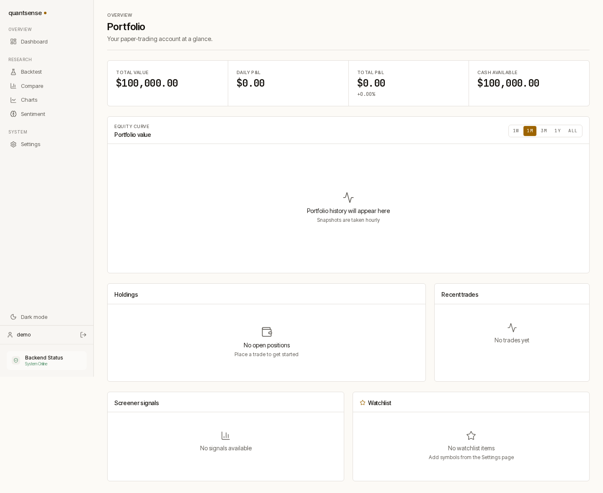 | 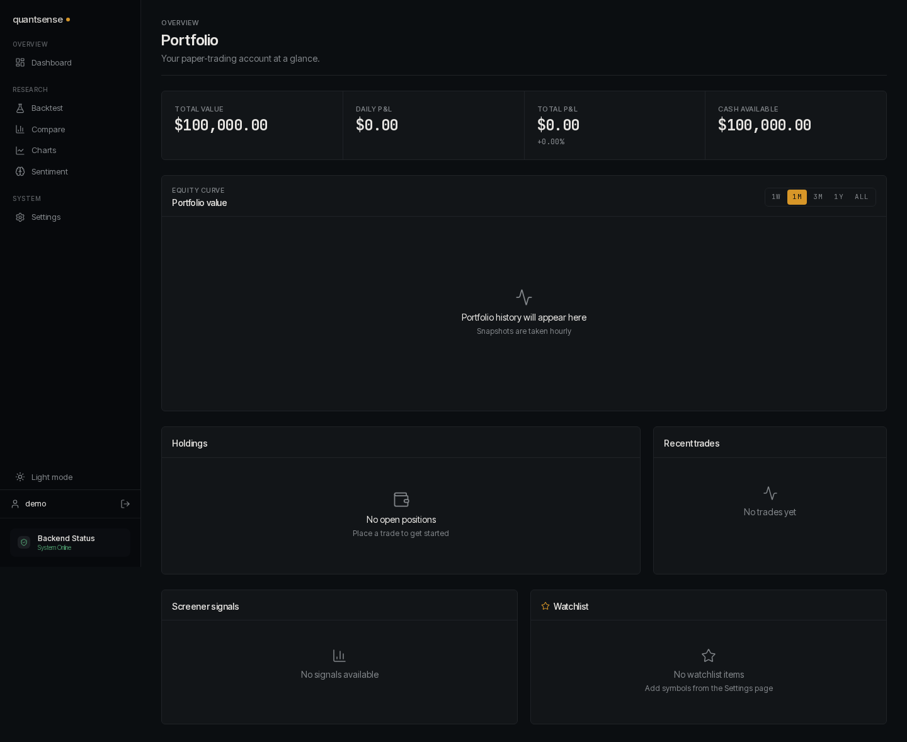 |
| Backtest | 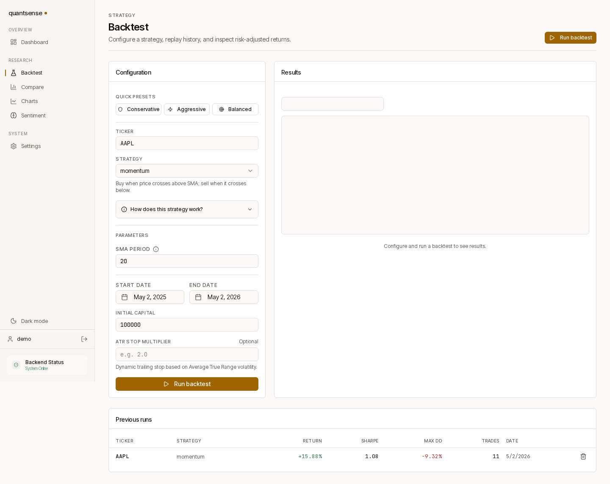 | 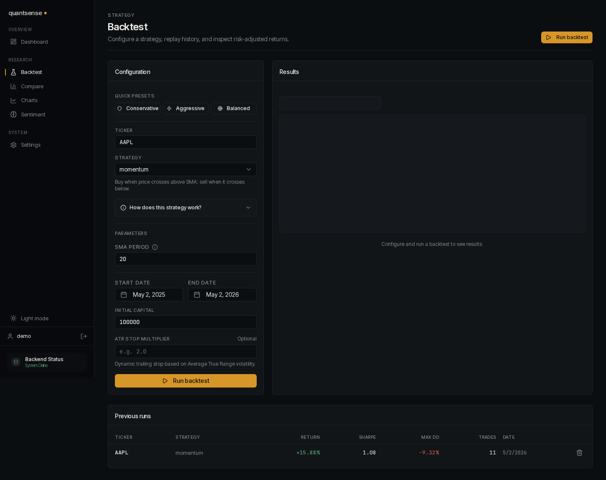 |
| Charts | 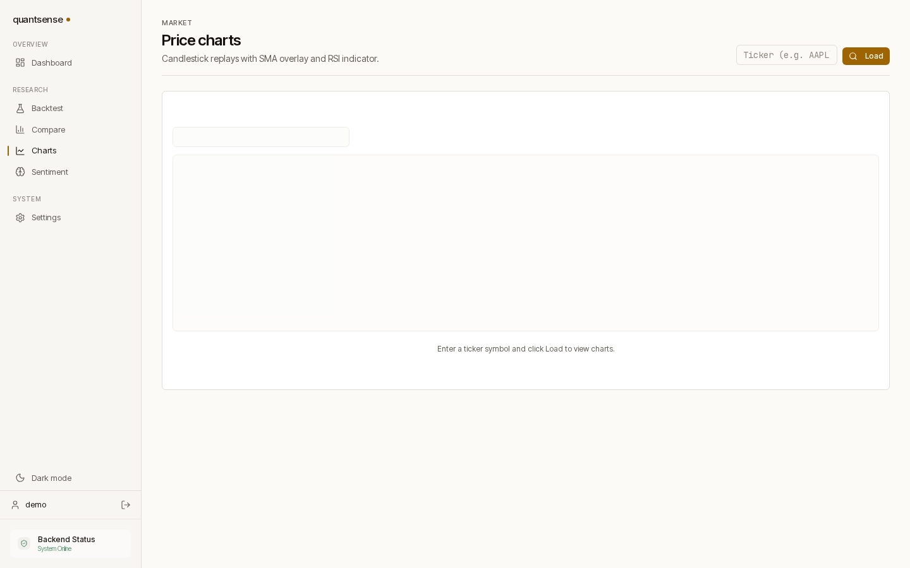 | 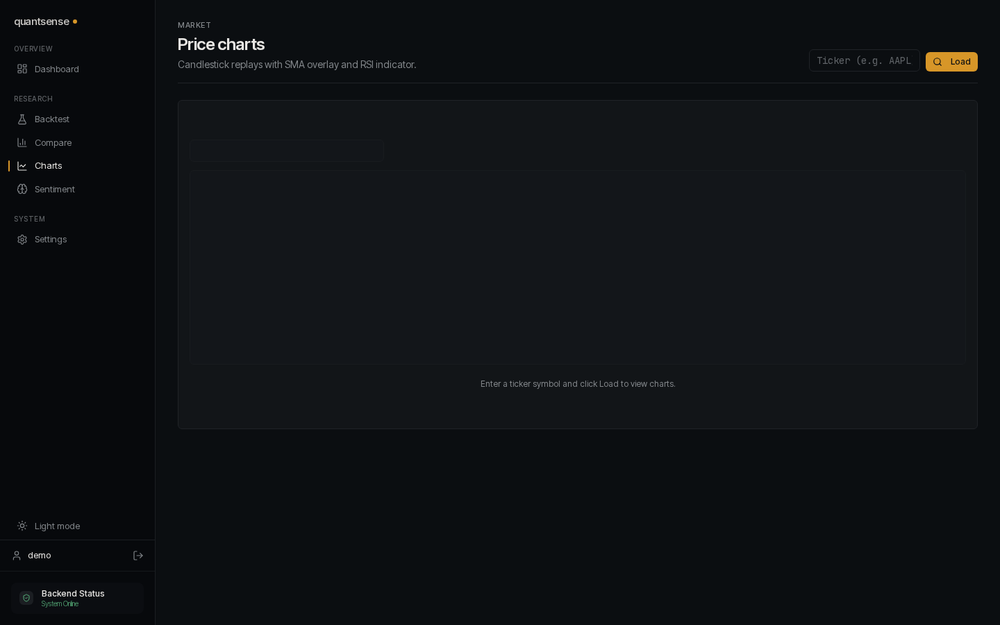 |
| Compare | 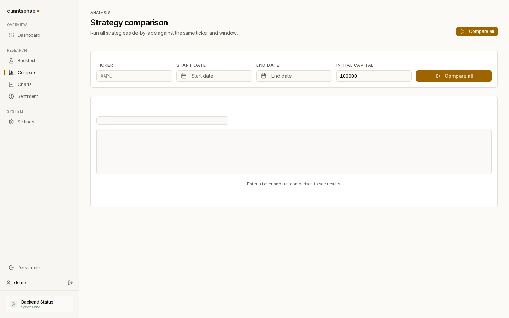 | 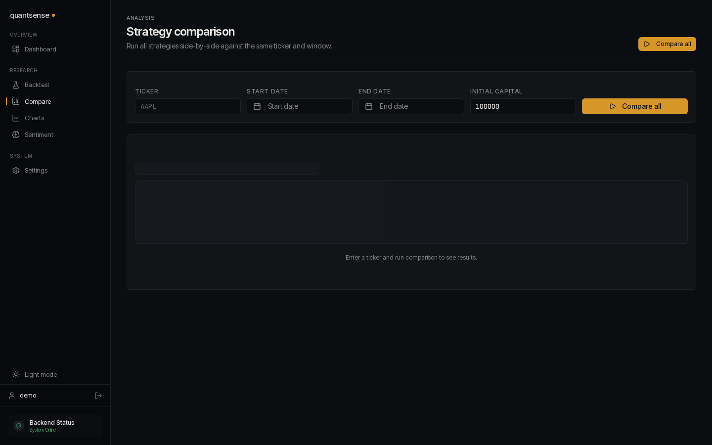 |
| Sentiment | 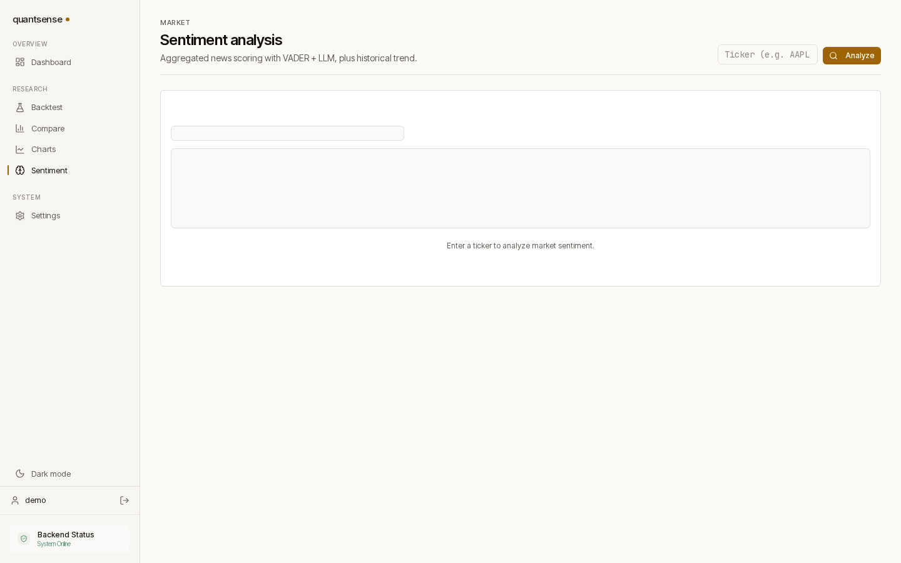 | 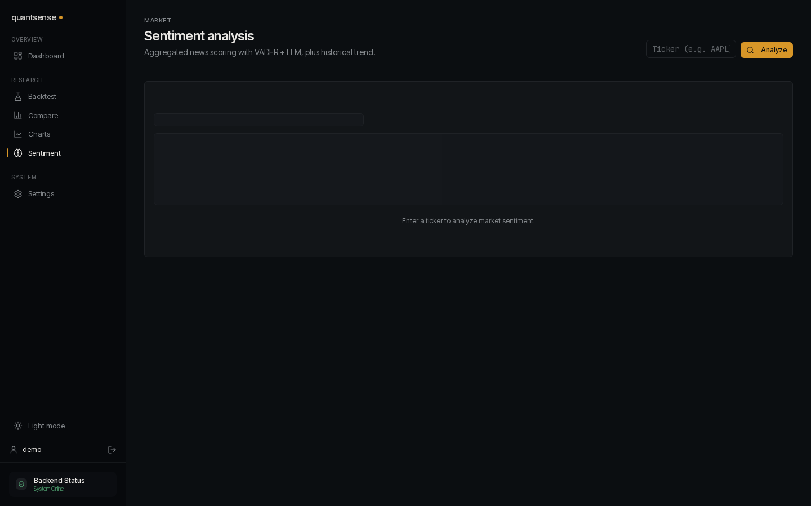 |
| Settings | 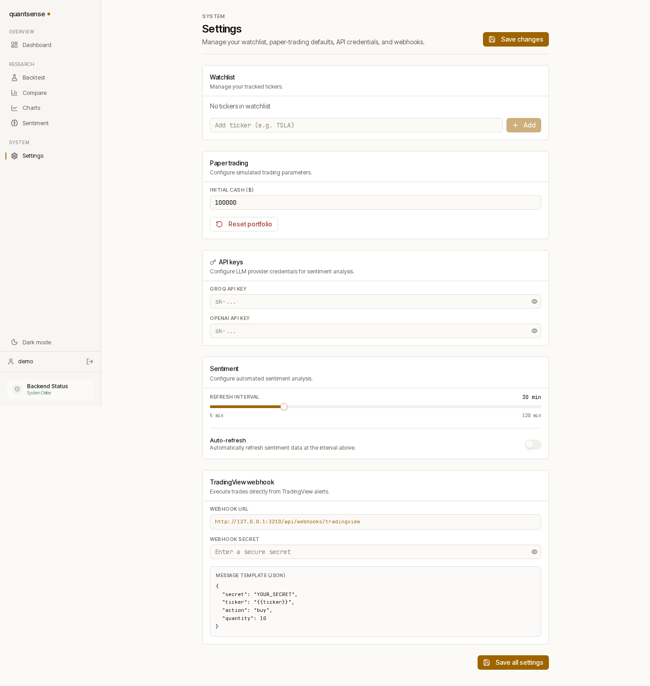 | 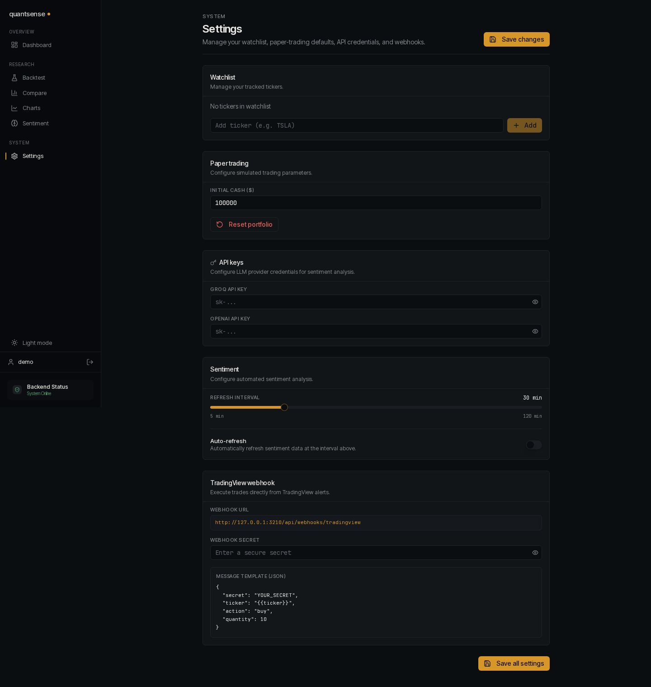 |
| Login | 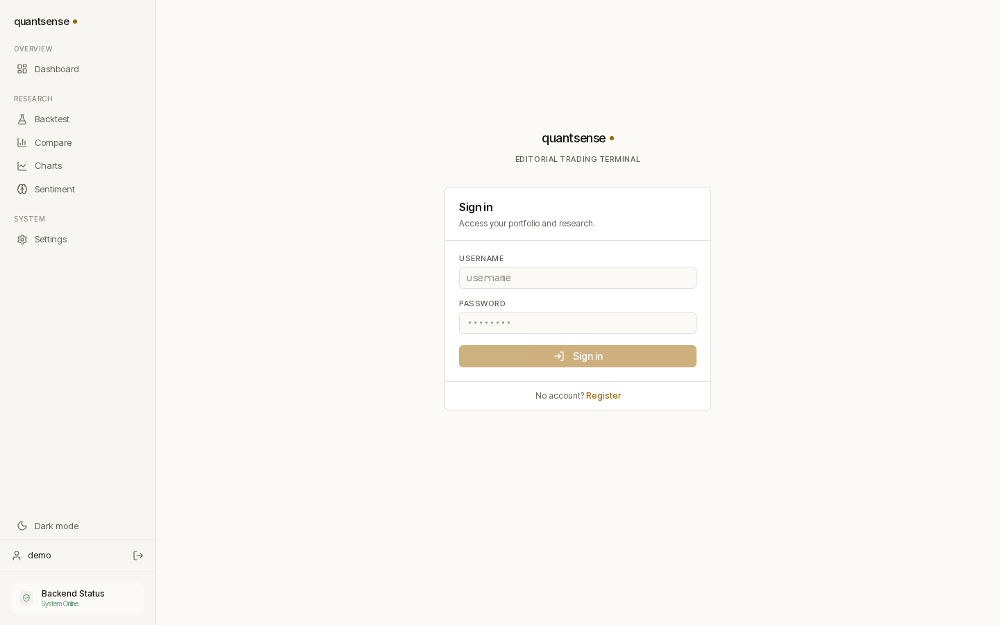 | 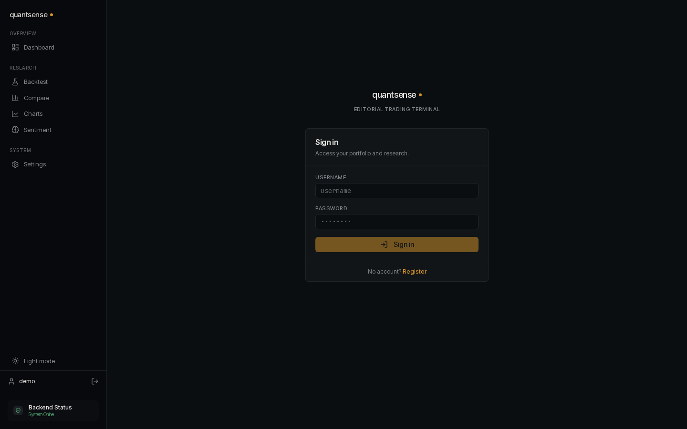 |

Regenerate via `node scripts/screenshots.mjs` (requires the backend on `:8765` and a built frontend on `:3210`; defaults overridable with `BASE` and `API` env vars).

---

## Design choices

| Choice                                | Why                                                                                                                                    |
| ------------------------------------- | -------------------------------------------------------------------------------------------------------------------------------------- |
| **Next-bar-open execution**           | Same-bar-close fills are the most common backtest bug. They make every momentum strategy look profitable. Don't.                       |
| **Slippage in basis points**          | Realistic for liquid equities. Default 5 bps; configurable per-run.                                                                    |
| **Anchored walk-forward**             | A single-pass grid search reports the best-in-sample Sharpe, which is meaningless. Walk-forward forces you to look at honest OOS perf. |
| **Deflated Sharpe Ratio**             | Sharpe inflates with the number of strategies tested. DSR penalizes for grid size and reports a probability the true Sharpe > 0.       |
| **Permutation test**                  | Cheap, intuitive answer to "is the signal real, or is it just the return distribution?"                                                |
| **Bootstrap CI on Sharpe**            | A point estimate is not a result. A CI is.                                                                                             |
| **Sentiment is research-only**        | Mixing fuzzy NLP signals into trading rules is hard to defend statistically. Sentiment endpoints exist for discretionary research.     |
| **No live broker integration**        | A personal project that "trades real money" is theatre. Paper trading is the honest scope.                                             |

---

## Quickstart

```bash
# Backend
cd backend
python3 -m venv venv && source venv/bin/activate
pip install -r requirements.txt
python -c "import nltk; nltk.download('vader_lexicon')"
uvicorn main:app --reload

# Frontend
cd frontend
npm install
npm run dev

# Tests
cd backend && pytest
```

API docs at http://localhost:8000/docs once the server is running.

---

## Running a significance test (example)

```bash
curl -X POST http://localhost:8000/api/backtest/significance \
  -H "Content-Type: application/json" \
  -d '{
    "ticker": "SPY",
    "strategy_type": "momentum",
    "params": {"sma_period": 20},
    "start_date": "2020-01-01",
    "end_date": "2024-12-31",
    "initial_capital": 100000
  }'
```

Returns a Sharpe point estimate, a 95% bootstrap CI, and a permutation-test p-value, with a one-line interpretation.

---

## Roadmap

- Block-bootstrap CI for autocorrelated returns
- Multi-asset portfolio backtester with rebalancing
- White's Reality Check / SPA test for strategy comparison
- Alpha/beta computed against a configurable benchmark series
